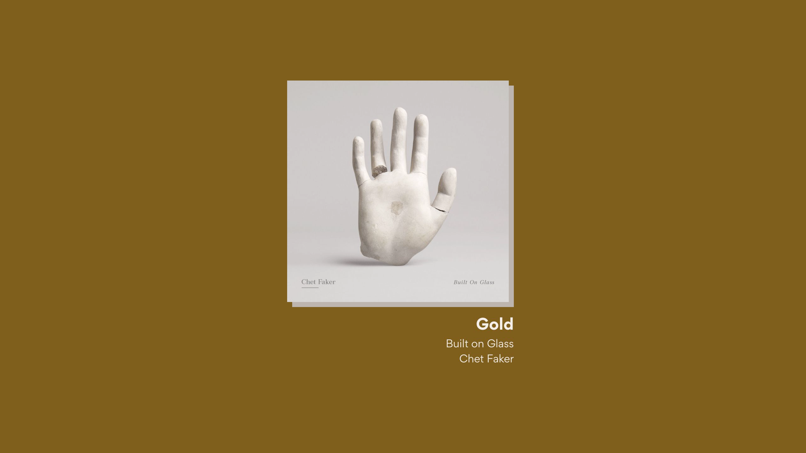
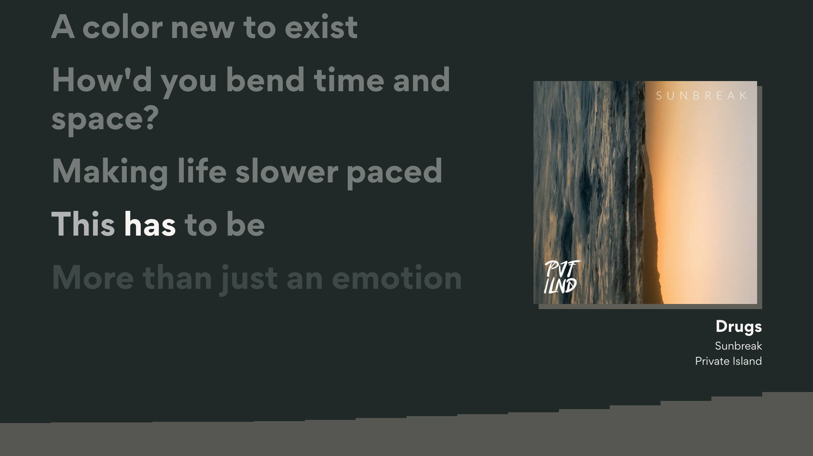
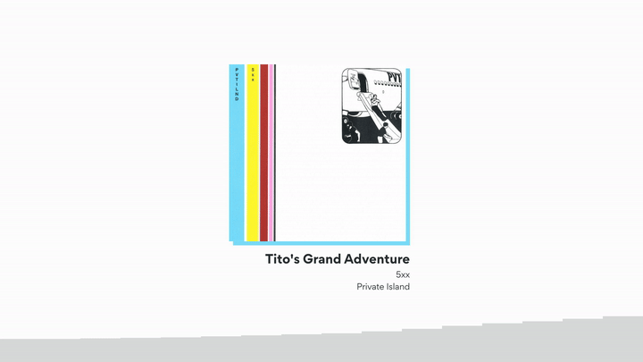

  

  

  

[Full video demo](https://youtu.be/8w8nkJMx9L4)

# [WIP] Scrolly

## The ultimate karaoke video workflow

To run:

    python scrolly/build.py

&nbsp;

    usage: build.py [-h] [-d | --darkMode | --no-darkMode] [-p | --preview | --no-preview] [-t | --transcribe | --no-transcribe] [-u URI] filename
    
    positional arguments:
      filename              path to music file
    
    options:
      -h, --help            show this help message and exit
      -d, --darkMode, --no-darkMode
                            give your video a dark theme (default: False)
      -p, --preview, --no-preview
                            init remotion and show preview (default: False)
      -t, --transcribe, --no-transcribe
                            transcribe lyrics from audio instead of fetching from Musixmatch (default: False)
      -u URI, --uri URI, --url URI
                            Spotify URI to assist in fetching lyrics (default: )